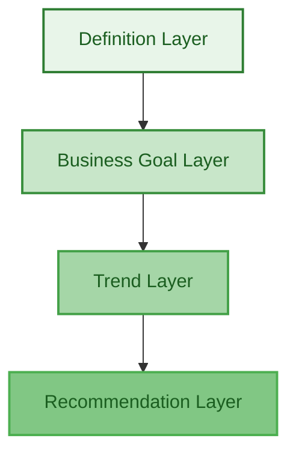
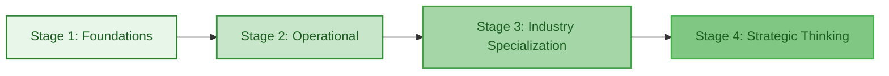

<div align="center">

# 📊 Business Metrics Mastery for Data Analysts

### *— Speaking the Language of Business*

<br>


[](https://github.com/coder-akram-khan)
[](https://github.com/coder-akram-khan)
[](LICENSE)
[](CONTRIBUTING.md)

<br>

</div>


## 🎯 Why This Repository Exists

<div align="center">

*The more fluent you are in your industry's key metrics,*  
*the more valuable you become in interviews and real business environments.*

</div>

<br>

### 🔑 Hiring Managers Prefer Analysts Who:

```diff
+ Already understand business drivers
+ Can diagnose metric fluctuations
+ Can communicate insights in plain English
+ Think beyond dashboards
```

### 💡 Almost every stakeholder question boils down to::

| # | Question |
|---|----------|
| 1️⃣ | **Why did this happen?** |
| 2️⃣ | **Is it good or bad?** |
| 3️⃣ | **What should we do about it?** |

> 📖 This repository is a **structured playbook** to master business metrics from **foundation to investor-level understanding**.


## 👥 Who This Is For

- Data Analysts preparing for product, growth, or business-focused roles  
- Analysts transitioning into SaaS, FinTech, E-commerce, or Retail  
- Professionals who want to move from reporting to strategic thinking  
- Anyone who wants to speak executive language confidently  


## 📚 Table of Contents

- [🧠 Core Foundations](#-1-core-foundations)
- [🏗️ Metrics Live in Layers](#️-2-metrics-live-in-layers)
- [💰 Financial Foundations](#-3-financial-foundations)
- [📈 Growth & Marketing Metrics](#-4-growth--marketing-metrics)
- [🔁 Retention & Cohort Metrics](#-5-retention--cohort-metrics)
- [💻 SaaS Metrics](#-6-saas-metrics)
- [🛒 E-commerce Metrics](#-7-e-commerce-metrics)
- [💳 FinTech Metrics](#-8-fintech-metrics)
- [🏬 Retail Metrics](#-9-retail-metrics)
- [🎯 Interview-Level Thinking](#-10-interview-level-thinking)
- [🧮 Unit Economics](#-11-unit-economics)
- [📚 Learning Resources](#-12-free-learning-resources)
- [🗺️ Learning Roadmap](#️-13-learning-roadmap)
- [💭 Final Philosophy](#-final-philosophy)


## 🧠 1. Core Foundations

### 📊 What is a Metric?

<table>
<tr>
<td>

A **metric** is a quantitative value that measures business performance.

**Examples:**
- 💰 Revenue
- 📈 Conversion Rate
- 📉 Churn
- 🔄 Retention
- 💹 Profit Margin

</td>
</tr>
</table>

### 🎨 What is a Dimension?

<table>
<tr>
<td>

A **dimension** adds context to a metric.

**Examples:**
- 🌍 Country
- 📱 Channel
- 📦 Product
- 👥 Cohort
- 🎯 Customer Segment

</td>
</tr>
</table>

### 🔍 Key Principle

<div align="center">

| Metrics | Dimensions |
|---------|------------|
| **"How much?"** | **"Who, What, Where, When?"** |

</div>


<div align="right">

[⬆️ Back to Top](#-business-metrics-mastery-for-data-analysts)

</div>

## 🏗️ 2. Metrics Live in Layers

<div align="center">



</div>

<br>

| Layer | Focus |
|-------|-------|
| 🔢 **Definition Layer** | Formula & calculation |
| 🎯 **Business Goal Layer** | Why it matters |
| 📈 **Trend Layer** | Patterns over time |
| 💡 **Recommendation Layer** | What action should we take? |

<div align="center">

> 🚀 **Great analysts move upward through all four layers.**

</div>


<div align="right">

[⬆️ Back to Top](#-business-metrics-mastery-for-data-analysts)

</div>

## 💰 3. Financial Foundations

<div align="center">


**Non-Negotiable Knowledge**

</div>

| Metric | Formula | Description |
|--------|---------|-------------|
| 💵 **Revenue** | - | Total income generated from sales |
| 📊 **Gross Profit** | Revenue – COGS | Profit before operating expenses |
| 📈 **Gross Margin** | Gross Profit / Revenue | Profitability percentage |
| 💹 **Contribution Margin** | Revenue – Variable Costs | Covers fixed costs |
| 🏦 **Operating Profit** | Revenue – Operating Expenses | Core business profitability |
| 💰 **Net Profit** | After taxes & interest | Final bottom line |


<div align="right">

[⬆️ Back to Top](#-business-metrics-mastery-for-data-analysts)

</div>

## 📈 4. Growth & Marketing Metrics

<div align="center">


</div>

| Metric | What It Measures | Icon |
|--------|------------------|------|
| **Traffic** | Website visitors | 🌐 |
| **Conversion Rate** | % users completing action | 🎯 |
| **CAC** | Customer Acquisition Cost | 💸 |
| **LTV** | Lifetime Value | 💎 |
| **ROAS** | Return on Ad Spend | 📊 |
| **CTR** | Click Through Rate | 🖱️ |

### 🔥 LTV/CAC Ratio

<div align="center">

```
Healthy SaaS Benchmark: 3:1 or higher
```


</div>


<div align="right">

[⬆️ Back to Top](#-business-metrics-mastery-for-data-analysts)

</div>

## 🔁 5. Retention & Cohort Metrics

<div align="center">


</div>

### 📉 Churn Rate
```
Customers lost during period / Total customers
```

### 📈 Retention Rate
```
Customers retained / Total customers
```

### 👥 Cohort Analysis

> **Definition:** Tracking groups of users acquired in same time period.

**Used to diagnose:**
- 🔧 Product issues
- 🔄 Retention problems
- 📢 Campaign effectiveness


<div align="right">

[⬆️ Back to Top](#-business-metrics-mastery-for-data-analysts)

</div>

## 💻 6. SaaS Metrics

<div align="center">


**Advanced Section**

</div>

| Metric | Formula/Description | Benchmark |
|--------|---------------------|-----------|
| 💰 **MRR** | Monthly Recurring Revenue | - |
| 📅 **ARR** | MRR × 12 | - |
| 👤 **ARPU** | Average Revenue Per User | - |
| 🔄 **NRR** | Revenue retained + expansions | **120%+** |
| ⏱️ **Payback Period** | CAC / Monthly contribution margin | **<12 months** |
| 📊 **Rule of 40** | Growth Rate + Profit Margin | **≥ 40%** |

<div align="center">

```diff
! World-class SaaS NRR: 120%+
```

</div>


<div align="right">

[⬆️ Back to Top](#-business-metrics-mastery-for-data-analysts)

</div>

## 🛒 7. E-commerce Metrics

<div align="center">


</div>

| Metric | Why It Matters | Impact |
|--------|---------------|--------|
| 💵 **AOV** | Average Order Value | Revenue optimization |
| 🛒 **Cart Abandonment** | Checkout friction | Conversion loss |
| 📦 **Inventory Turnover** | Operational efficiency | Cash flow |
| 🔄 **Repeat Purchase Rate** | Customer loyalty | LTV growth |
| 💹 **Contribution Margin** | Discount strategy impact | Profitability |


<div align="right">

[⬆️ Back to Top](#-business-metrics-mastery-for-data-analysts)

</div>

## 💳 8. FinTech Metrics

<div align="center">


</div>

<table>
<tr>
<td width="50%">

**Volume & Revenue**
- 💸 Transaction Volume
- 📊 Take Rate
- 💰 Net Interest Margin

</td>
<td width="50%">

**Risk & Efficiency**
- ⚠️ Default Rate
- 🛡️ Fraud Rate
- 💵 Customer Acquisition Cost

</td>
</tr>
</table>


<div align="right">

[⬆️ Back to Top](#-business-metrics-mastery-for-data-analysts)

</div>

## 🏬 9. Retail Metrics

<div align="center">


</div>

| Metric | Icon | Focus Area |
|--------|------|------------|
| **Same Store Sales Growth** | 📈 | Revenue trends |
| **Revenue per Square Foot** | 🏢 | Space efficiency |
| **Sell-Through Rate** | 📊 | Inventory management |
| **Stock Turnover** | 🔄 | Operational efficiency |
| **Shrinkage Rate** | ⚠️ | Loss prevention |


<div align="right">

[⬆️ Back to Top](#-business-metrics-mastery-for-data-analysts)

</div>

## 🎯 10. Interview-Level Thinking

<div align="center">


</div>

### ✅ You Are Ready When You Can:

```python
def interview_ready():
    skills = [
        "Take a dataset",
        "Generate 2–3 business-relevant insights",
        "Explain them in plain English",
        "Identify which metric matters most and why",
        "Recommend action"
    ]
    return all(skills)
```

### 💬 Example of Executive Communication:

<table>
<tr>
<td>

> 💡 **"Revenue increased 18% MoM driven by expansion revenue from existing enterprise customers. However, new customer acquisition declined 12%, indicating potential top-of-funnel weakness."**

</td>
</tr>
</table>

<div align="center">

**That is executive communication.** ✨

</div>


<div align="right">

[⬆️ Back to Top](#-business-metrics-mastery-for-data-analysts)

</div>

## 🧮 11. Unit Economics

<div align="center">


</div>

### 🎯 The Core Question:

<div align="center">

```
"Do we make money per customer?"
```

</div>

### 📐 Formula:

```
Unit Economics = Contribution Margin per Customer – CAC
```

### 📊 Interpretation:

<div align="center">

| Result | Meaning | Action |
|--------|---------|--------|
| ❌ Negative | Unsustainable growth | 🔴 Fix economics |
| ✅ Positive | Scalable model | 🟢 Scale up |

</div>


<div align="right">

[⬆️ Back to Top](#-business-metrics-mastery-for-data-analysts)

</div>

## 📚 12. Free Learning Resources

<div align="center">


</div>

### 📖 Books
*(Read Summaries If Needed)*

| Book | Focus |
|------|-------|
| 📘 *Lean Analytics* | Startup metrics |
| 📗 *Financial Intelligence for Entrepreneurs* | Financial literacy |

### 🌐 Startup & VC Blogs

<table>
<tr>
<td>

- 🚀 [Y Combinator Startup School](https://www.startupschool.org/) (Free)
- 💼 [a16z blog](https://a16z.com/)
- 📊 [Sequoia Capital blog](https://www.sequoiacap.com/)

</td>
</tr>
</table>

### 🏢 Real Company Learning

**📁 Study:**
- Investor presentations
- Earnings reports
- Annual reports

**🔍 Search Examples:**
```bash
"Zomato investor presentation PDF"
"Shopify earnings report"
"Stripe annual letter"
```

**📈 This Teaches:**
- ✅ What executives actually track
- ✅ How metrics are narrated
- ✅ How strategy connects to numbers


<div align="right">

[⬆️ Back to Top](#-business-metrics-mastery-for-data-analysts)

</div>

## 🗺️ 13. Learning Roadmap

<div align="center">


</div>



### 📊 Stage 1: Foundations

<table>
<tr>
<td>

- 📄 Financial statements
- 💰 Revenue & profit metrics
- 🎯 Conversion funnel

</td>
</tr>
</table>

### 📈 Stage 2: Operational Metrics

<table>
<tr>
<td>

- 📢 Marketing efficiency
- 🔄 Retention analysis
- 👥 Cohort modeling

</td>
</tr>
</table>

### 🎓 Stage 3: Industry Specialization

<table>
<tr>
<td width="50%">

**Tech & Digital**
- 💻 SaaS health metrics
- 🛒 E-commerce optimization

</td>
<td width="50%">

**Traditional Industries**
- 💳 FinTech risk metrics
- 🏬 Retail store analytics

</td>
</tr>
</table>

### 🚀 Stage 4: Strategic Thinking

<table>
<tr>
<td>

- 🧮 Unit economics
- 📊 Investor benchmarks
- 🌐 Market comparison
- 📈 Forecasting & scenario modeling

</td>
</tr>
</table>


<div align="right">

[⬆️ Back to Top](#-business-metrics-mastery-for-data-analysts)

</div>

## 💭 Final Philosophy

<div align="center">

### Metrics Are Not Just Numbers

</div>

<table>
<tr>
<td width="33%" align="center">

**🏥 Health Signals**

Signals of business health

</td>
<td width="33%" align="center">

**🎯 Decision Drivers**

Drivers of decision-making

</td>
<td width="33%" align="center">

**📖 Leadership Stories**

Narratives for leadership

</td>
</tr>
</table>


<!--
### 🔄 The Transformation

<div align="center">

<table>
<tr>
<td align="center" width="50%">

### ❌ Before

```
"Here's the dashboard."
```

</td>
<td align="center" width="50%">

### ✅ After

```
"Here's what's happening,
why it's happening,
and what we should do next."
```

</td>
</tr>
</table>

</div>

---
-->
<div align="right">

[⬆️ Back to Top](#-business-metrics-mastery-for-data-analysts)

</div>

## 👨‍💻 Author

<div align="center">


<br><br>

**Akram Khan**  
*Data Analyst | Business-Focused Problem Solver*

<br>

Building strategic, metric-driven intelligence systems.

<br><br>

[](https://github.com/coder-akram-khan)
[](https://linkedin.com/in/mr-akram-khan)

</div>


<div align="center">

### 🌟 If you found this helpful, please give it a star!

[](https://github.com/coder-akram-khan/business-metrics-playbook)

<br>

**Made with ❤️ for the Data Analytics Community**

<br>


*© 2026 Akram Khan. All Rights Reserved.*

</div>

